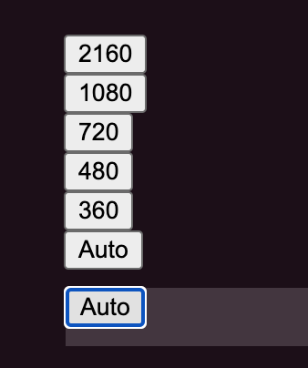
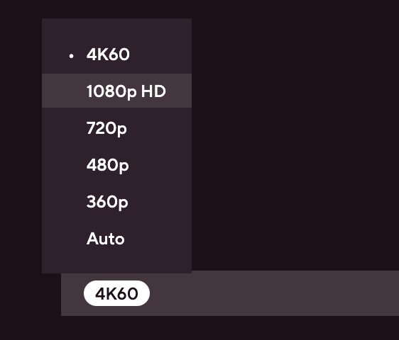

Building an HLS.js video player quality selector in React.

<!-- truncate -->

### A React hook to get and set the quality of an HLS.js video

To get and set the video quality we need to listen to the hls.js events and also set the `currentLevel` property on the hls instance.

```jsx
import Hls, { LevelSwitchedData, ManifestParsedData } from "hls.js";
import { useEffect, useMemo, useState } from "react";

export const AUTO = -1;

export interface Level {
  height: number;
  index: number;
}

export const useHlsQualityLevels = ({ hls }: { hls: Hls | null }) => {
  const [levels, setLevels] = useState<Level[]>();
  const [currentLevelIndex, setCurrentLevelIndex] = useState<number>(AUTO);
  const [isAutoLevelEnabled, setIsAutoLevelEnabled] = useState<boolean>(true);

  useEffect(() => {
    if (!hls) return;

    function onLevelSwitched(eventName: string, data: LevelSwitchedData) {
      setCurrentLevelIndex(data.level);
    }

    function onManifestParsed(eventName: string, data: ManifestParsedData) {
      const mappedLevels = data.levels.map((level, index) => ({
        height: level.height,
        index,
      }));
      const sortedLevels = mappedLevels.sort((a, b) => b.height - a.height);
      setLevels(sortedLevels);
    }

    hls.on(Hls.Events.LEVEL_SWITCHED, onLevelSwitched);
    hls.on(Hls.Events.MANIFEST_PARSED, onManifestParsed);

    return () => {
      hls.off(Hls.Events.LEVEL_SWITCHED, onLevelSwitched);
      hls.off(Hls.Events.MANIFEST_PARSED, onManifestParsed);
    };
  }, [hls]);

  const handleQualityChange = useMemo(() => {
    return hls !== null
      ? (level: number) => {
          setIsAutoLevelEnabled(level === AUTO);
          hls.currentLevel = level;
        }
      : () => undefined;
  }, [hls]);

  return {
    levels,
    isAutoLevelEnabled,
    currentLevelIndex,
    handleQualityChange,
  };
};
```

And I use this to pass level information to a React component like this:

```jsx
const {
  levels = [],
  currentLevelIndex,
  isAutoLevelEnabled,
  handleQualityChange,
} = useHlsQualityLevels({ hls });

return (
  <QualityLevelsButton
    levels={levels}
    currentLevelIndex={currentLevelIndex}
    isAutoLevelEnabled={isAutoLevelEnabled}
    onQualityChanged={handleQualityChange}
  />
);
```

### Building the UI

Create a popup menu with a button that shows the current quality level and a list of quality levels to choose from. I'm using [Headless UI](https://headlessui.com/react/popover) for this.

```jsx
<Popover>
  <Popover.Button>
    {levels.find((level) => level.index === currentLevelIndex)?.height ??
      "Auto"}
  </Popover.Button>
  <Popover.Panel>
    {levels.map((level) => (
      <Popover.Button
        key={level.index}
        onClick={() => onQualityChanged(level.index)}
      >
        {level.height}
      </Popover.Button>
    ))}
    <Popover.Button onClick={() => onQualityChanged(-1)}>Auto</Popover.Button>
  </Popover.Panel>
</Popover>
```

This results in a functional but not pretty UI:


#### Positioning the popup with Popper.js

```jsx
const [referenceElement, setReferenceElement] = useState<HTMLButtonElement | null>();
const [popperElement, setPopperElement] = useState<HTMLDivElement | null>();
const { styles, attributes } = usePopper(referenceElement, popperElement, {
  placement: "top",
  modifiers: [
    {
      name: "offset",
      options: {
        offset: [0, 10],
      },
    },
  ],
});

return (
  <Popover className="relative">
    <Popover.Button ref={setReferenceElement}>
      {levels.find((level) => level.index === currentLevelIndex)?.height ?? "Auto"}
    </Popover.Button>
    <Popover.Panel ref={setPopperElement} style={styles.popper} {...attributes.popper}>
      {levels.map((level) => (
        <Popover.Button key={level.index} onClick={() => onQualityChanged(level.index)}>
          {level.height}
        </Popover.Button>
      ))}
      <Popover.Button onClick={() => onQualityChanged(-1)}>Auto</Popover.Button>
    </Popover.Panel>
  </Popover>
);
```

The popup is now positioned correctly:



#### Add some styling with Tailwind CSS



#### Finally add a transition

Using the [Transition element from Headless UI](https://headlessui.com/react/transition)

```jsx
import { Transition } from "@headlessui/react";

<Transition
  as={Fragment}
  enter="transition-opacity ease-out duration-500"
  enterFrom="opacity-0"
  enterTo="opacity-100"
  leave="transition-opacity ease-in duration-200"
  leaveFrom="opacity-100"
  leaveTo="opacity-0"
>
  <Popover.Panel>/* ... */</Popover.Panel>
</Transition>;
```
