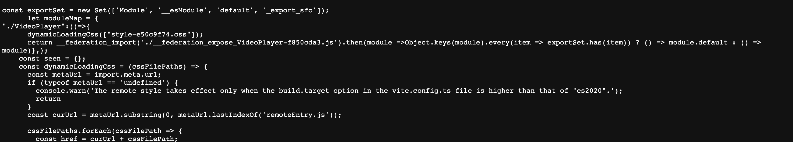
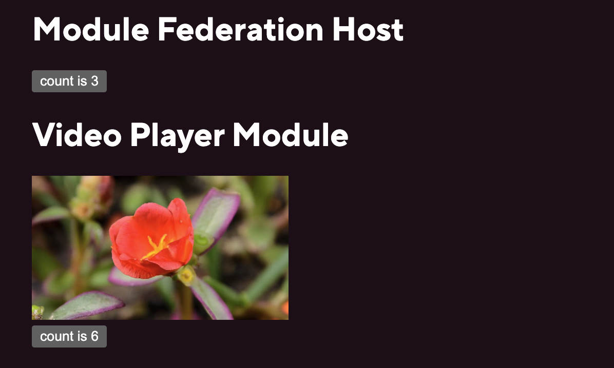

Sharing code between applications with Module Federation.

<!-- truncate -->

## What is Module Federation?

Module Federation is a way to share code between applications. It is a feature of Webpack 5 and is also available as a plugin for Vite.

## Why use Module Federation?

Module Federation allows you to share code between applications. This can be useful if you have a component library that you want to share between applications. It can also be useful if you want to share a single component between applications.

This has benefits over an npm module, including the ability to share state between applications and the ability to share code without publishing to npm.

## Create a Project for the Remote Module

I'm using a video player as an example here.

#### Create a Vite project

Follow these steps to [setup a new Vite project](../2023-08-25-new-vite-project-setup/index.md)

#### Install the Vite module federation plugin

```bash
pnpm add @originjs/vite-plugin-federation -D
```

#### Fix the port

This is so that we can point a host application here.

```json
"scripts": {
    "dev": "vite --port 5001 --strictPort",
},
```

#### Create a VideoPlayer component

```jsx
import { useState } from "react";

function VideoPlayer({ src }) {
  const [count, setCount] = useState(0);

  return (
    <>
      <h1>Video Player Module</h1>
      <div>
        <video width="250" autoPlay muted>
          <source src={src} type="video/webm" />
        </video>
      </div>

      <button onClick={() => setCount((count) => count + 1)}>
        count is {count}
      </button>
    </>
  );
}

export default VideoPlayer;
```

#### Configure the Vite module federation plugin

Add the configuration to the plugins array of `vite.config.js`:

```js
import { defineConfig } from "vite";
import react from "@vitejs/plugin-react";
import basicSsl from "@vitejs/plugin-basic-ssl";
import federation from "@originjs/vite-plugin-federation";

// https://vitejs.dev/config/
export default defineConfig({
  server: {
    port: 3000,
    https: true,
  },
  plugins: [
    react(),
    /* install for local SSL*/
    /* pnpm add @vitejs/plugin-basic-ssl -D */
    basicSsl(),
    federation({
      name: "video_player_module",
      // file name for the manifest file, defaults to remoteEntry.js
      filename: "remoteEntry.js",
      exposes: {
        // expose each component you want to share
        // path to the component: name of the component
        "./VideoPlayer": "./src/VideoPlayer",
      },
      //  share react and react-dom from the host
      shared: ["react", "react-dom"],
    }),
  ],
  build: {
    outDir: "dist",
    modulePreload: false,
    target: "esnext",
    minify: false,
    cssCodeSplit: false,
  },
});
```

#### Let's check that worked...

```bash
pnpm build && pnpm preview
```

Then browse to "https://localhost:5001/assets/remoteEntry.js" and you should see a manifest file.



It's important to note you need to run `pnpm build` to generate the manifest file.

## Configure the Host Application

#### Install the Vite module federation plugin

```bash
pnpm add @originjs/vite-plugin-federation -D
```

#### Configure the plugin

Configure the plugin in `vite.config.js` by adding the plugin to the plugins array:

```js
import federation from "@originjs/vite-plugin-federation";

export default defineConfig({
  plugins: [
    react(),
    basicSsl() /* local SSL */,
    federation({
      name: "host",
      remotes: {
        videoPlayerModule: "https://localhost:5001/assets/remoteEntry.js",
      },
      shared: ["react", "react-dom"], //  share react and react-dom from the host
    }),
  ],
  // ... rest of your config
});
```

#### Import the remote Component into the Host Application

```jsx
import { useState } from "react";
// eslint-disable-next-line import/no-unresolved
import VideoPlayer from "videoPlayerModule/VideoPlayer"; // can use React.lazy here

export default function ModuleFederationPage() {
  const [count, setCount] = useState(0);

  return (
    <>
      <h1>Module Federation Host</h1>
      <button onClick={() => setCount((count) => count + 1)}>
        count is {count}
      </button>
      <VideoPlayer src="https://interactive-examples.mdn.mozilla.net/media/cc0-videos/flower.webm" />
    </>
  );
}
```

#### Add declaration file

For TypeScript, you need to add a declaration file to the host application (declarations.d.ts):

```ts
declare module "videoPlayerModule/VideoPlayer" {
  const VideoPlayer: React.ComponentType<{ src: string }>;
  export default VideoPlayer;
}
```

#### Run the Host Application

Run the host application and see the remote component working in the host application.

```bash
pnpm start
```


