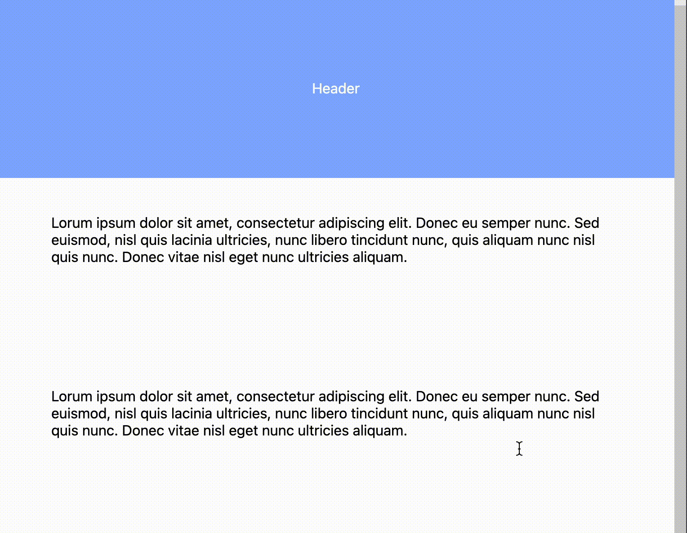
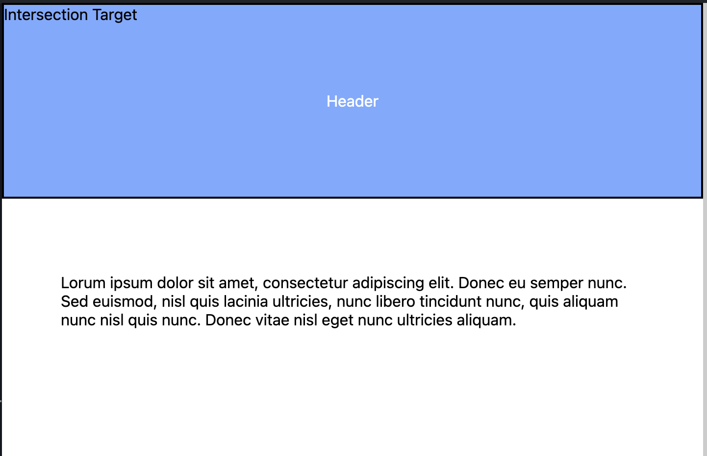
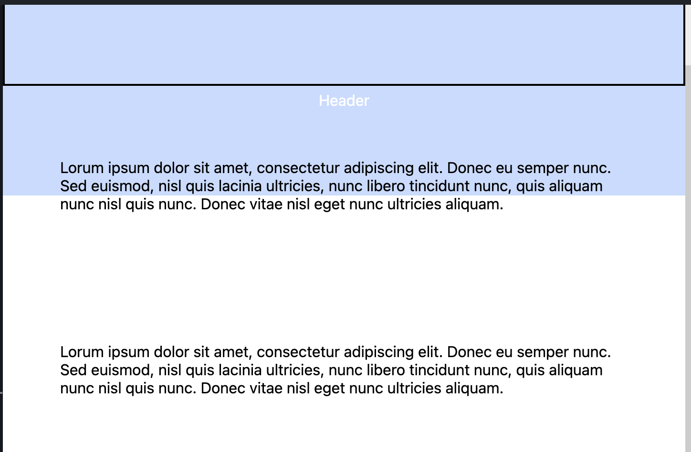

Using the Intersection Observer API to trigger transitions.

<!-- truncate -->
### Intersection Observer for Simple Transition

Given a ["sticky"](https://developer.mozilla.org/en-US/docs/Web/CSS/position#sticky) header which must transition from opaque to transparent when the user scrolls the page content up, we can use the [Intersection Observer API](https://developer.mozilla.org/en-US/docs/Web/API/Intersection_Observer_API) to trigger the transition.



#### The Intersection Observer

The Intersection Observer is given a target element and triggers a callback when the target element is visible in the viewport. The primary use case is for lazy loading images and ads, as well as for infinite scrolling.

Intersection observer is a performant alternative to listening for scroll events, because it offloads the work to the browser. The browser will optimize the work by batching the callbacks and throttling the events.

#### Intersection Observer for Header Opacity

In our case, we create a hidden div overlay on the header (our intersection "target") and trigger the callback when that target div is being scrolled up and exiting the viewport.

I'm using `useIntersectionObserver` from [usehooks-ts](https://usehooks-ts.com/react-hook/use-intersection-observer) which simplifies using the Intersection Observer API in React.

The returned `entry` object from the hook contains the `intersectionRatio` which is a value between 0 and 1, where 0 is the target is not visible and 1 is the target is fully visible. We can use this value to set the opacity of the header.

```ts
import { useIntersectionObserver } from "usehooks-ts";
import { useRef } from "react";

export const App = () => {
  const ref = useRef<HTMLDivElement>(null);

  const entry = useIntersectionObserver(ref, {
    root: null,
    threshold: Array.from({ length: 100 }).map((_, i) => i / 100), // calls back at 1% intersections [0, 0.01, 0.02, ... 0.99, 1]
    rootMargin: "0px",
  });

  return (
    <div>
      <header
        style={{
          opacity: entry?.intersectionRatio,
          backgroundColor: "#81a9ff",
          color: "#fff",
          height: "200px",
          position: "sticky",
          display: "flex",
          justifyContent: "center",
          alignItems: "center",
          top: 0,
          zIndex: -1,
        }}
      >
        Header
      </header>

      <div
        ref={ref}
        style={{
          height: "200px",
          position: "absolute",
          top: 0,
          width: "100%",
          color: "#000",
          border: "2px solid #000",
        }}
      >
        Intersection Target (Hidden)
      </div>

      {Array.from({ length: 10 }).map((_, idx) => (
        <p style={{ padding: "60px" }} key={idx}>
          Lorum ipsum dolor sit amet, consectetur adipiscing elit. Donec eu
          semper nunc. Sed euismod, nisl quis lacinia ultricies, nunc libero
          tincidunt nunc, quis aliquam nunc nisl quis nunc. Donec vitae nisl
          eget nunc ultricies aliquam.
        </p>
      ))}
    </div>
  );
};
```





[Run this on StackBlitz](https://stackblitz-starters-saun4d.stackblitz.io/)
