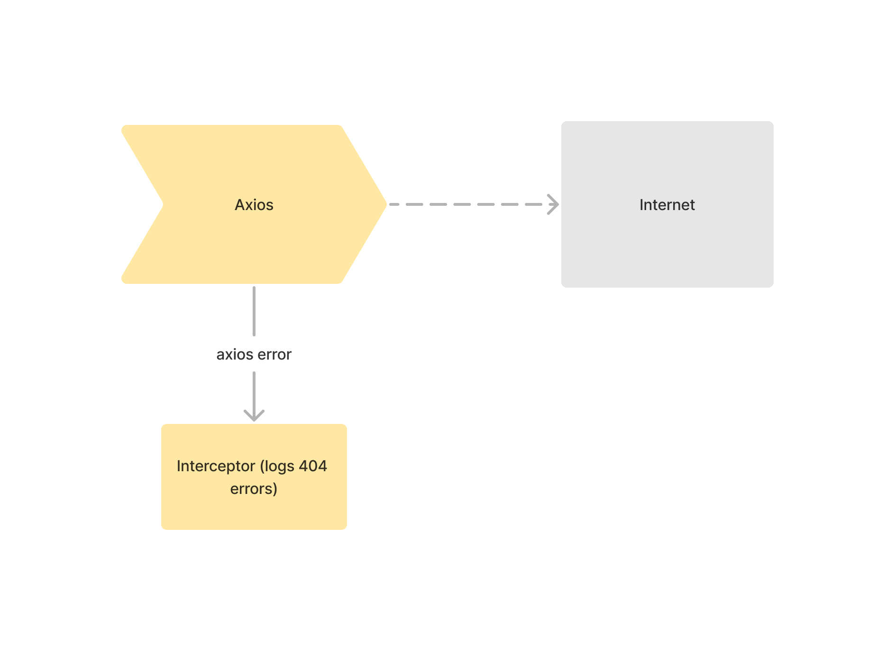
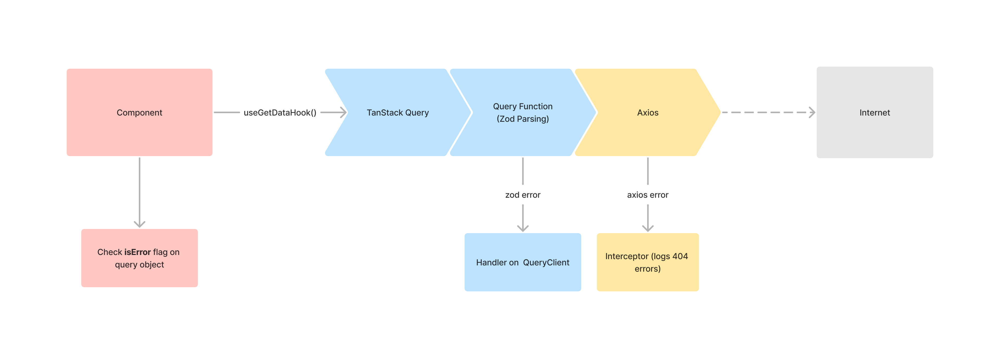
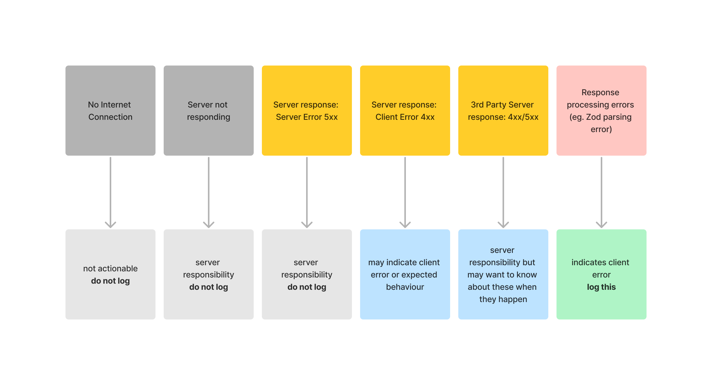

Logging frontend errors when using Axios and TanStack Query.

<!-- truncate -->

## Handle Axios Errors Consistently in 1 Place with Interceptors

To log errors in the API layer, we can use Axios interceptors. Interceptors are functions that Axios calls for every request and response. We can use interceptors to log errors, and to handle errors in a consistent way.

```ts
import * as Sentry from "@sentry/browser";
import { AxiosError } from "axios";

/**
 * Interceptor function that logs errors and captures exceptions using Sentry.
 * @param error - The AxiosError object representing the error.
 * @returns A rejected Promise with the error object.
 */
export const loggingInterceptor = (error: AxiosError) => {
  /* Log 4xx errors, as they are likely to be client issues that are actionable.
  4xx errors are expected in some cases. Use validateStatus to ignore on individual requests */
  if (
    error.response?.status &&
    error.response.status >= 400 &&
    error.response.status < 500
  ) {
    Sentry.captureException(error);
  }

  /* Do not log network errors, as they are likely to be client issues that are not actionable. */
  /* Do not log 5xx errors, as they are likely to be server issues, and will be logged by the server. */
  return Promise.reject(error);
};
```



## Handle TanStack Query Errors Consistently in 1 Place

When something goes wrong in a query, for example a Zod parsing error, it throws an error. We can use the `onError` option to handle these errors consistently in one place.

```ts
import * as Sentry from "@sentry/browser";
import { QueryCache, QueryClient } from "@tanstack/react-query";

const queryClient = new QueryClient({
  queryCache: new QueryCache({
    onError: (error) => {
      // capture all ZodErrors with Sentry
      if (error instanceof z.ZodError) {
        console.error(error); // helpful for debugging zod errors
        Sentry.captureException(error);
      }
    },
  }),
});
```



TanStack Query can be configured to throw errors that can be caught with a React Error Boundary. This may be a useful way to respond to data fetching errors in the UI layer.

## What to log

There are several types of errors that can occur when making and processing data from HTTP requests. Some of these errors are actionable, and some are not. Here are some examples of errors that are actionable:

- 4xx errors: These errors are likely to be client issues, and are actionable. For example, a 404 error indicates that the resource was not found.

- 5xx errors: These errors are likely to be server issues, and are not actionable. For example, a 500 error indicates that the server encountered an unexpected condition.

- Data parsing errors: These errors are likely to be client issues, and are actionable. For example, a Zod parsing error indicates that the data from the server does not match the expected schema.

- Network errors: These errors are likely to be client issues, and are not actionable. For example, a network error indicates that the client is not connected to the internet.


