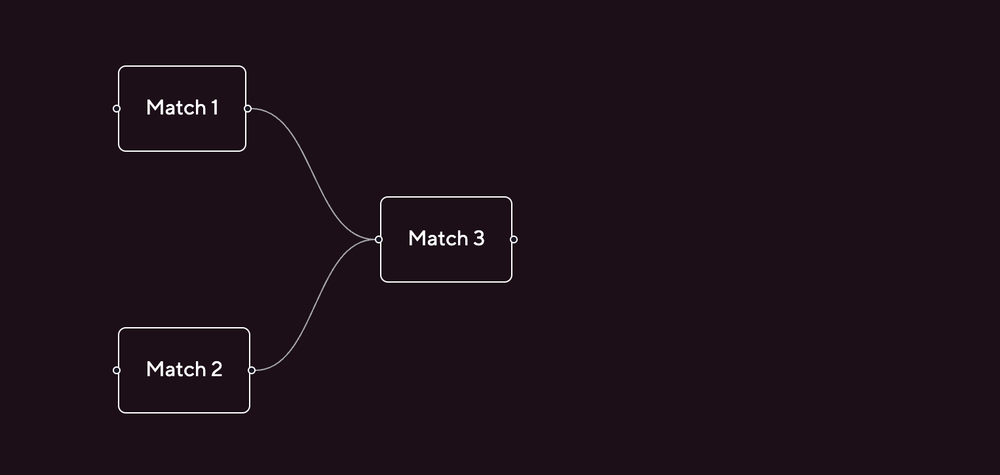
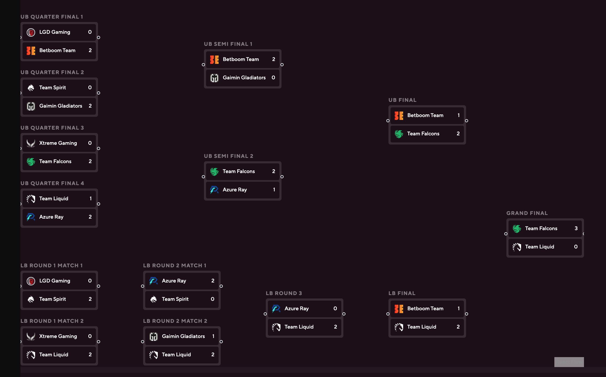

Using React Flow to create a somewhat dynamic elimination bracket for a tournament.

<!-- truncate -->

## Starting off with 3 nodes and 2 edges

Here I define a custom node type "match" that has a label and two handles, one on the left and one on the right.



```ts
import ReactFlow, { Handle, Position } from "reactflow";
import "reactflow/dist/style.css";

function MatchNode({ data }: { data: { label: string } }) {
  return (
    <>
      <Handle type="target" position={Position.Left} id="a" />
      <div className="rounded border p-5">{data.label}</div>
      <Handle type="source" position={Position.Right} id="b" />
    </>
  );
}

const nodeTypes = { match: MatchNode };

const initialNodes = [
  { id: "1", type: "match", position: { x: 100, y: 100 }, data: { label: "Match 1" } },
  { id: "2", type: "match", position: { x: 100, y: 300 }, data: { label: "Match 2" } },
  { id: "3", type: "match", position: { x: 300, y: 200 }, data: { label: "Match 3" } },
];
const initialEdges = [
  { id: "e1-3", source: "1", target: "3" },
  { id: "e2-3", source: "2", target: "3" },
];

export function FlowTest() {
  return (
    <div style={{ width: "100vw", height: "100vh" }}>
      <ReactFlow nodeTypes={nodeTypes} nodes={initialNodes} edges={initialEdges} />
    </div>
  );
}

```

## Custom Match component for nodes

Next I add a custom match component that shows team logos, names, and scores. Positions are hard-coded for each match index, these will remain hard-coded so that the layout matches the bracket design exactly.



```ts
import ReactFlow, { Handle, Position } from "reactflow";
import { double_elim_8_finished } from "../DoubleElim8/mockData";
import "reactflow/dist/style.css";
import { Match } from "./Match";
import { BracketSeries } from "@data/tournament/shared/types/bracket";

const matchIndexToPositions: { [key: number]: { node: { x: number; y: number } } } = {
  // upper bracket quarter final 1
  0: {
    node: {
      x: 0,
      y: 45,
    },
  },
  // upper bracket quarter final 2
  1: {
    node: {
      x: 0,
      y: 151,
    },
  },
  // upper bracket quarter final 3
  2: {
    node: {
      x: 0,
      y: 257,
    },
  },
  // upper bracket quarter final 4
  3: {
    node: {
      x: 0,
      y: 363,
    },
  },
  // lower bracket, round 1, match 1
  4: {
    node: {
      x: 0,
      y: 520,
    },
  },
  // lower bracket, round 1, match 2
  5: {
    node: {
      x: 0,
      y: 626,
    },
  },
  // upper bracket semi final 1
  6: {
    node: {
      x: 350,
      y: 97,
    },
  },
  // upper bracket semi final 2
  7: {
    node: {
      x: 350,
      y: 311,
    },
  },
  // lower bracket round 2, match 1
  8: {
    node: {
      x: 234,
      y: 520,
    },
  },
  // lower bracket round 2, match 2
  9: {
    node: {
      x: 234,
      y: 626,
    },
  },
  // lower bracket round 3
  10: {
    node: {
      x: 468,
      y: 573,
    },
  },
  // upper bracket final
  11: {
    node: {
      x: 702,
      y: 204,
    },
  },
  // lower bracket final
  12: {
    node: {
      x: 702,
      y: 573,
    },
  },
  // grand final
  13: {
    node: {
      x: 927,
      y: 420,
    },
  },
};

function MatchNode({ data }: { data: BracketSeries }) {
  return (
    <>
      <Handle type="target" position={Position.Left} id="a" />
      {/* custom match component showing team logos, names, scores */}
      <Match match={data} />
      <Handle type="source" position={Position.Right} id="b" />
    </>
  );
}

const nodeTypes = { match: MatchNode };

const initialNodes = double_elim_8_finished?.matches?.map((match) => ({
  id: match.uuid,
  type: "match",
  position: matchIndexToPositions[match.index].node,
  data: match,
}));
const initialEdges = [
];

export function FlowTest() {
  return (
    <div className="relative w-full">
      <div className="custom-scrollbar relative overflow-x-scroll">
        <div
          style={{
            width: "1075px",
            height: "720px",
            minWidth: "1075px",
            minHeight: "600px",
          }}
        >
          <ReactFlow nodeTypes={nodeTypes} nodes={initialNodes} edges={initialEdges} />
        </div>
      </div>
    </div>
  );
}

```