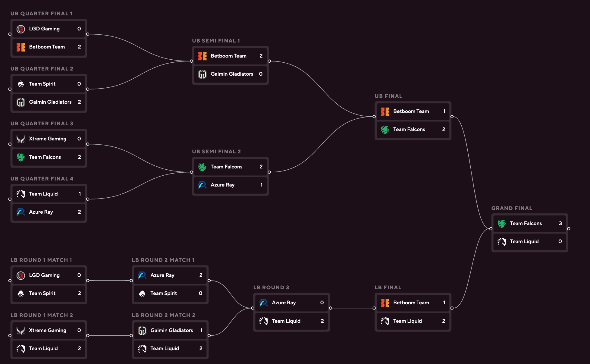
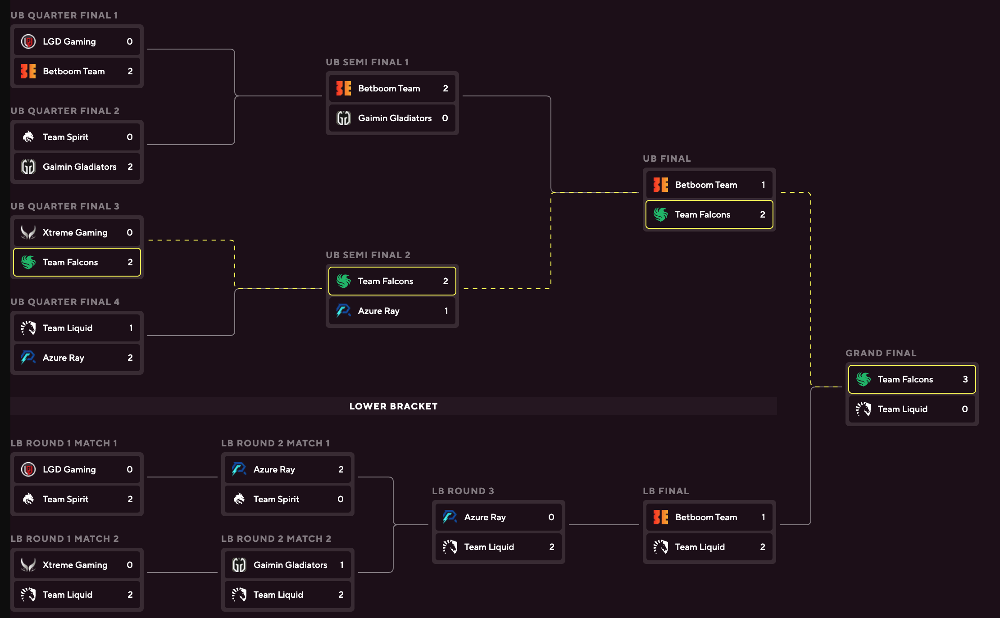

Using React Flow to create a somewhat dynamic elimination bracket for a Dota 2 tournament. I need to layout the bracket to match some design very closely, so I need to be able to hard-code the positions of the nodes, but connect them automatically. I also need to animate the edges to highlight the winning path a team has taken.

<!-- truncate -->

## Starting off with 3 nodes and 2 edges

Here I define a custom node type "match" that has a label and two handles, one on the left and one on the right.


```ts
import ReactFlow, { Handle, Position } from "reactflow";
import "reactflow/dist/style.css";

function MatchNode({ data }: { data: { label: string } }) {
  return (
    <>
      <Handle type="target" position={Position.Left} id="a" />
      <div className="rounded border p-5">{data.label}</div>
      <Handle type="source" position={Position.Right} id="b" />
    </>
  );
}

const nodeTypes = { match: MatchNode };

const initialNodes = [
  { id: "1", type: "match", position: { x: 100, y: 100 }, data: { label: "Match 1" } },
  { id: "2", type: "match", position: { x: 100, y: 300 }, data: { label: "Match 2" } },
  { id: "3", type: "match", position: { x: 300, y: 200 }, data: { label: "Match 3" } },
];
const initialEdges = [
  { id: "e1-3", source: "1", target: "3" },
  { id: "e2-3", source: "2", target: "3" },
];

export function FlowTest() {
  return (
    <div style={{ width: "100vw", height: "100vh" }}>
      <ReactFlow nodeTypes={nodeTypes} nodes={initialNodes} edges={initialEdges} />
    </div>
  );
}

```

## Custom Match component for nodes

Next I add a custom match component that shows team logos, names, and scores. Positions are hard-coded for each match index, these will remain hard-coded so that the layout matches the bracket design exactly.


```ts
import ReactFlow, { Handle, Position } from "reactflow";
import { double_elim_8_finished } from "../DoubleElim8/mockData";
import "reactflow/dist/style.css";
import { Match } from "./Match";
import { BracketSeries } from "@data/tournament/shared/types/bracket";

const matchIndexToPositions: { [key: number]: { node: { x: number; y: number } } } = {
  // upper bracket quarter final 1
  0: {
    node: {
      x: 0,
      y: 45,
    },
  },
  // upper bracket quarter final 2
  1: {
    node: {
      x: 0,
      y: 151,
    },
  },
  // upper bracket quarter final 3
  2: {
    node: {
      x: 0,
      y: 257,
    },
  },
  // upper bracket quarter final 4
  3: {
    node: {
      x: 0,
      y: 363,
    },
  },
  // lower bracket, round 1, match 1
  4: {
    node: {
      x: 0,
      y: 520,
    },
  },
  // lower bracket, round 1, match 2
  5: {
    node: {
      x: 0,
      y: 626,
    },
  },
  // upper bracket semi final 1
  6: {
    node: {
      x: 350,
      y: 97,
    },
  },
  // upper bracket semi final 2
  7: {
    node: {
      x: 350,
      y: 311,
    },
  },
  // lower bracket round 2, match 1
  8: {
    node: {
      x: 234,
      y: 520,
    },
  },
  // lower bracket round 2, match 2
  9: {
    node: {
      x: 234,
      y: 626,
    },
  },
  // lower bracket round 3
  10: {
    node: {
      x: 468,
      y: 573,
    },
  },
  // upper bracket final
  11: {
    node: {
      x: 702,
      y: 204,
    },
  },
  // lower bracket final
  12: {
    node: {
      x: 702,
      y: 573,
    },
  },
  // grand final
  13: {
    node: {
      x: 927,
      y: 420,
    },
  },
};

function MatchNode({ data }: { data: BracketSeries }) {
  return (
    <>
      <Handle type="target" position={Position.Left} id="a" />
      {/* custom match component showing team logos, names, scores */}
      <Match match={data} />
      <Handle type="source" position={Position.Right} id="b" />
    </>
  );
}

const nodeTypes = { match: MatchNode };

const initialNodes = double_elim_8_finished?.matches?.map((match) => ({
  id: match.uuid,
  type: "match",
  position: matchIndexToPositions[match.index].node,
  data: match,
}));
const initialEdges = [
];

export function FlowTest() {
  return (
    <div className="relative w-full">
      <div className="custom-scrollbar relative overflow-x-scroll">
        <div
          style={{
            width: "1075px",
            height: "720px",
          }}
        >
          <ReactFlow nodeTypes={nodeTypes} nodes={initialNodes} edges={initialEdges} />
        </div>
      </div>
    </div>
  );
}

```

## Adding edges to connect the nodes

```ts
const edges = double_elim_8_finished?.matches
  ?.filter((match) => match.winnerGoesTo?.seriesUUID)
  .map((match) => ({
    id: `edge-${match.uuid}`,
    source: match.uuid,
    target: match.winnerGoesTo!.seriesUUID,
  }));
```



## Add corners to the edges

Add a `type: "smoothstep"` to the edge object to add corners to the edges. See [https://reactflow.dev/examples/edges/edge-types](React Flow Edge Types)


## Animating the winning path of a team

When hovering on a team we want to show the how that team has moved through the bracket. We can do this by setting the active team id in the state and updating the edges to be animated if the team has won the match the edge is coming from. We also change the color of the edge to yellow if it is animated.

```ts
const [activeTeamId, setActiveTeamId] = useState<string>();

  const nodes = useMemo(
    () =>
      matches?.map((match) => ({
        id: match.uuid,
        type: "match",
        position: matchIndexPositions[match.index].node,
        data: { match, activeTeamId, onTeamHover: setActiveTeamId },
      })),
    [matches, activeTeamId, matchIndexPositions],
  );

  const edges = useMemo(
    () =>
      matches
        ?.filter((match) => match.winnerGoesTo?.seriesUUID) // filter out grand final (no next match so so edge needed)
        .map((match) => {
          const animated =
            activeTeamId === undefined
              ? false
              : match.teamA?.isEliminated
                ? match.teamB?.uuid === activeTeamId
                : match.teamA?.uuid === activeTeamId;

          return {
            id: `edge-${match.uuid}`,
            type: "smoothstep",
            source: match.uuid,
            target: match.winnerGoesTo!.seriesUUID,
            animated,
            zIndex: animated ? 10 : 0,
            style: {
              stroke: activeTeamId ? (animated ? "#fffe3e" : "#8D858C") : "#D2CED1",
            },
          };
        }),
    [matches, activeTeamId],
  );
```




## Configuring additional behaviours

React Flow comes with a lot of built-in behaviours that can be configured. For example, we can disable the ability to zoom in and out, pan on drag, select elements, and prevent scrolling.

```ts
<ReactFlow
  nodeTypes={nodeTypes}
  nodes={nodes}
  edges={edges}
  // prevent selecting nodes
  elementsSelectable={false}
  // prevent zooming
  zoomOnScroll={false}
  zoomOnDoubleClick={false}
  zoomOnPinch={false}
  // prevent panning & scrolling
  panOnDrag={false}
  preventScrolling={false}
  proOptions={{
    hideAttribution: true,
  }}
/>
```
