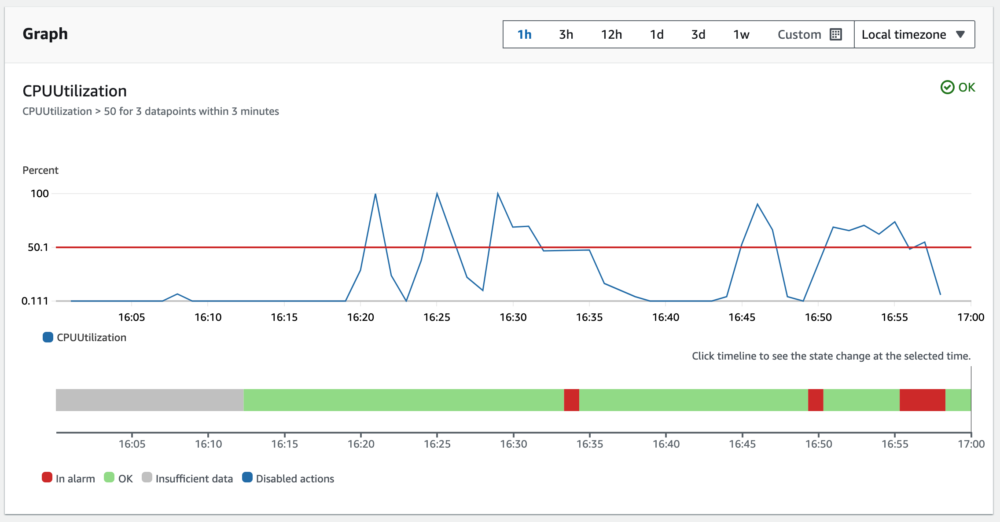

CDK snippets for auto-scaling ECS Fargate tasks with CDK.

<!-- truncate -->

## Create a Load Balanced Fargate Service

```ts
import * as ecs_patterns from "aws-cdk-lib/aws-ecs-patterns";

const loadBalancedFargateService = new ecs_patterns.ApplicationLoadBalancedFargateService(
  this,
  `${environmentProjectName}-alb`,
  {
    ..., // omitted for brevity
    cpu: 1024,
    memoryLimitMiB: 2048,
    // do not set desiredCount when using auto-scaling
    // https://blog.cloudglance.dev/deep-dive-on-ecs-desired-count-and-circuit-breaker-rollback/index.html
    // desiredCount: 1, 

  },
);
```

## Add Auto-scaling to the Service

```ts
const fargateService = loadBalancedFargateService.service;

// create an auto-scaling target
const scalableTarget = fargateService.autoScaleTaskCount({
  minCapacity: 1,
  maxCapacity: 10,
});

// add a scaling policy to scale based on average CPU utilization
scalableTarget.scaleOnCpuUtilization("CpuScaling", {
  policyName: `${environmentProjectName}-cpu-scaling`,
  targetUtilizationPercent: 50, // auto-scale to maintain 50% average CPU utilization
});
```

## Considerations

ECS sends CloudWatch metrics to CloudWatch for the service, but only every minute. 

The `scaleOnCpuUtilization` method creates a CloudWatch alarm that triggers the auto-scaling policy when the average CPU utilization exceeds the target utilization percent.



There is a scale-out (and scale-in) cool-down period which is the time to wait before another scaling operation can be performed. This is to prevent rapid scaling up and down which can be costly and disruptive. The default is 300 seconds (5 minutes).

Think carefully about the scaling metric you choose, you should load-test your service to understand the performance characteristics and choose a metric that will scale the service appropriately. AWS has a [guide on choosing suitable metrics](https://docs.aws.amazon.com/AmazonECS/latest/developerguide/capacity-autoscaling.html).

Load testing can be done with tools like [K6](https://k6.io/).

## References
https://docs.aws.amazon.com/AmazonECS/latest/developerguide/service-autoscaling-targettracking.html

https://docs.aws.amazon.com/AmazonECS/latest/developerguide/capacity-autoscaling.html

https://blog.cloudglance.dev/deep-dive-on-ecs-desired-count-and-circuit-breaker-rollback/index.html
