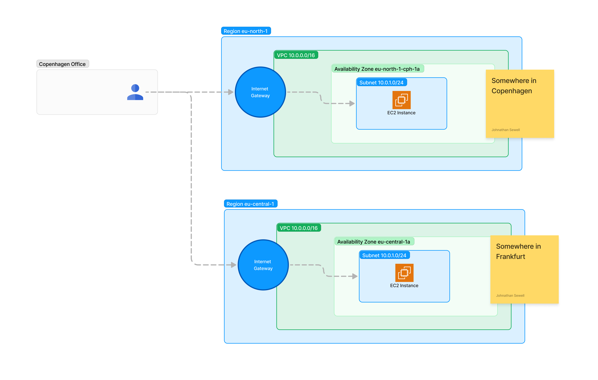

Investigating AWS Local Zones and testing latency vs standard AWS regions.

<!-- truncate -->

[AWS Local Zones](https://aws.amazon.com/about-aws/global-infrastructure/localzones/) are a new type of AWS infrastructure deployment that allows you to run applications that require single-digit millisecond latencies. You can place resources such as EC2 instances, containers, and other services closer to your end-users.

This can be useful for applications that require low-latency such as real-time gaming.

There is a limited number of [cities where Local Zones are available](https://aws.amazon.com/about-aws/global-infrastructure/localzones/locations/), and there is only [a subset of standard AWS features available](https://aws.amazon.com/about-aws/global-infrastructure/localzones/features/) in Local Zones.

# Testing Latency

To create a simple comparison, I created an EC2 instance in the eu-central-1 region and another in the Local Zone in Copenhagen (close to me). [The infrastructure setup is in CDK in this repo](https://github.com/johnathan-sewell/hackathon-local-zones/blob/main/stack/ServiceStackCph.ts).

Next I used a [simple JavaScript script](https://github.com/johnathan-sewell/hackathon-local-zones/blob/main/client/index.html) to measure the latency between my client and the two EC2 instances using a websocket connection and a simple ping-pong message.

The charts show the latency in milliseconds between the client and the two EC2 instances. The Local Zone instance has a lower latency than the eu-central-1 instance, averaging around **6ms**, while the eu-central-1 instance averages around **20ms**. This is a significant (around 3x) difference and could be important for applications that require very low latency.

# Conclusion

Local Zones are very fast. But standard zones are also fast. The benefits may be in the edge cases:

- apps with very large payloads
- very “chatty” apps that send a large volume of small requests

## Possible use cases:

- Multiplayer games
- Remote control & Automation - drones, automated systems (lights, music, effects)
- Augmented Reality apps
- In arena applications (“crowd-play” games)
- Turn phones into live video/photo/mics (live stream wall)
