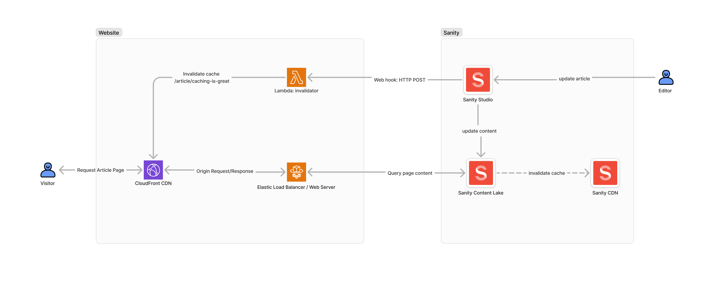

Using Sanity webhooks to trigger cache invalidation in CloudFront.

<!-- truncate -->

I have a Remix.js site that uses Sanity as a headless CMS for showing news articles. CloudFront is used to cache the server-rendered pages and reduce load on the server.

When a news article is added or updated the cache needs to be invalidated so that the new content is shown to users immediately. 

This can be done by creating a Lambda function that listens for webhooks from Sanity and triggers a cache invalidation in CloudFront.



## Define a Lambda function in AWS using CDK

```typescript
import * as cdk from "aws-cdk-lib";
import { Construct } from "constructs";
import * as path from "path";
import * as lambdaNode from "aws-cdk-lib/aws-lambda-nodejs";
import * as lambda from "aws-cdk-lib/aws-lambda";
import * as cloudfront from "aws-cdk-lib/aws-cloudfront";
import { config } from "./config";
import { LambdaRuntimeEnvironment } from "../src/config";

type ReservedEnvironmentVariables = "AWS_REGION";

export class LambdaStack extends cdk.Stack {
  public readonly lambdaFunction: lambdaNode.NodejsFunction;

  constructor(scope: Construct, id: string, props: cdk.StackProps) {
    super(scope, id, props);

    const serviceName = `${config.project.context}-${config.project.service}`;
    const functionName = `${serviceName}-${config.shortEnvironment}`;

    this.lambdaFunction = new lambdaNode.NodejsFunction(this, functionName, {
      functionName,
      runtime: lambda.Runtime.NODEJS_20_X,
      entry: path.join(__dirname, "../src/server/lambda.ts"),
      handler: "handler",
      memorySize: 512,
      timeout: cdk.Duration.minutes(2),
      bundling: {
        sourceMap: true,
        minify: false,
        forceDockerBundling: false,
      },
      environment: {
        ENVIRONMENT: config.environment,
        REPO_NAME: config.repoName,
        DISTRIBUTION_ID: config.cloudfront.distributionId,
        SANITY_WEBHOOK_SECRET: config.sanity.webhookSecret,
      } satisfies Omit<LambdaRuntimeEnvironment, ReservedEnvironmentVariables>,
    });

    // add a URL to the Lambda function so that it can be invoked from the internet
    const functionUrl = this.lambdaFunction.addFunctionUrl({
      authType: lambda.FunctionUrlAuthType.NONE,
    });

    // output the function url
    new cdk.CfnOutput(this, "FunctionUrl", {
      value: functionUrl.url,
    });

    // grant the lambda function permission to create invalidations on the cloudfront distribution
    const distribution = cloudfront.Distribution.fromDistributionAttributes(this, "distribution-lookup", {
      distributionId: config.cloudfront.distributionId,
      domainName: config.cloudfront.portalFrontendDistributionDomain,
    });
    distribution.grantCreateInvalidation(this.lambdaFunction);
  }
}

```

## Create a Lambda function

```typescript
import z from "zod";
import * as lambda from "aws-lambda";
import { isValidSignature, SIGNATURE_HEADER_NAME } from "@sanity/webhook";
import { logger } from "../logger";
import { invalidateCloudFrontCache } from "../services/cloudfront/invalidateCloudFrontCache";
import { config } from "../config";

// Example payload:
// {
//   "_id": "2649ebe5-519b-43dd-8c13-23c0705cf971",
//   "_type": "articlePage",
//   "_updatedAt": "2024-08-15T09:19:20Z",
//   "route": "/article/spring-showdown-2024-recap"
// }
export const SanityWebhookPayloadSchema = z.object({
  _id: z.string(),
  _updatedAt: z.string(),
  _type: z.literal("articlePage"),
  route: z.string(),
});


export const handler = async (event: lambda.APIGatewayProxyEventV2): Promise<lambda.APIGatewayProxyResultV2> => {
  logger.info({ event });

  if (event.requestContext.http.method !== "POST") {
    return {
      statusCode: 405,
      body: JSON.stringify({ message: "Method Not Allowed" }),
    };
  }

  if (!event.body) {
    return {
      statusCode: 400,
      body: JSON.stringify({ message: "Bad Request, missing request body" }),
    };
  }

  let decodedBody: string;
  let body: object;
  try {
    decodedBody = event.isBase64Encoded ? Buffer.from(event.body, "base64").toString("utf-8") : event.body;
    body = JSON.parse(decodedBody) as object;
  } catch (error) {
    return {
      statusCode: 400,
      body: JSON.stringify({ message: "Bad Request, invalid JSON body" }),
    };
  }

  // validate signature from Sanity 
  const signature = event.headers[SIGNATURE_HEADER_NAME] || "";
  const isValidRequest = await isValidSignature(decodedBody, signature, config.sanity.webhookSecret);
  if (!isValidRequest) {
    logger.warn({ signature }, "Invalid Sanity webhook signature");

    return {
      statusCode: 401,
      body: JSON.stringify({ message: "Invalid signature" }),
    };
  }

  // parse and validate body
  const parseResult = SanityWebhookPayloadSchema.safeParse(body);
  if (!parseResult.success) {
    return {
      statusCode: 400,
      body: JSON.stringify({ message: "Bad Request, invalid body schema", errors: parseResult.error }),
    };
  }
  const sanityWebhookPayload = parseResult.data;

  // invalidate cloudfront cache for individual article
  await invalidateCloudFrontCache({
    path: sanityWebhookPayload.route,
  });

  const response = {
    statusCode: 200,
    body: JSON.stringify({
      message: "CloudFront invalidation sent",
      payload: sanityWebhookPayload,
    }),
  };

  return response;
};  
```

```typescript
// invalidateCloudFrontCache.ts
import * as clientCloudfront from "@aws-sdk/client-cloudfront";
import { config } from "../../config";
import { logger } from "../../logger";

export async function invalidateCloudFrontCache({ path }: { path: string }) {
  const command = new clientCloudfront.CreateInvalidationCommand({
    DistributionId: config.cloudfront.portalFrontendDistributionId,
    InvalidationBatch: {
      // A value that you specify to uniquely identify an invalidation request.
      // CloudFront uses the value to prevent you from accidentally resubmitting an identical request
      CallerReference: `${config.project.context}-${config.project.service}-${
        config.shortEnvironment
      }_${new Date().toISOString()}`,
      Paths: {
        Quantity: 1,
        Items: [path],
      },
    },
  });

  const client = new clientCloudfront.CloudFrontClient({ region: config.aws.region });
  try {
    await client.send(command);
    logger.info({
      message: "CloudFront invalidation sent",
      path,
    });
  } catch (error) {
    logger.error({ error }, "Failed to send invalidation to CloudFront");
  }
}
```

## Sanity webhook

The Sanity Webhooks are defined in the Sanity admin UI under project --> API.

A webhook sends a POST request with a JSON payload.

GROQ Filter (defines schema types that trigger webhook):

```
_type == 'articlePage'
```

GROQ Projection (for webhook payload):

```
{
  _id,
  _type,
  _updatedAt
  route
}
```

The Sanity Webhook sends a POST request to the URL of the Lambda function.

To test the webhook, you can use a service like https://app.beeceptor.com to capture and inspect the webhook payload.

The webhooks use a secret (SANITY_WEBHOOK_SECRET) defined in the Github repository Secrets.

## Other Considerations

The Sanity Content Lake has an optional CDN on it's API, which can be slow to invalidate.

Remix loaders (server-side) should call the Sanity API without the CDN option to avoid stale data from the Sanity CDN getting into the Cloudfront CDN. When this happens invalidating the Cloudfront CDN may have no effect on the freshness of the website data.