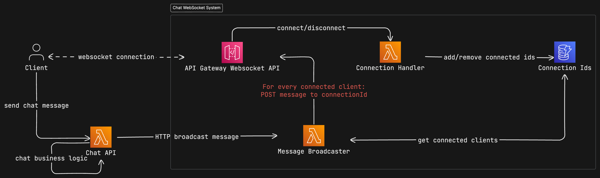
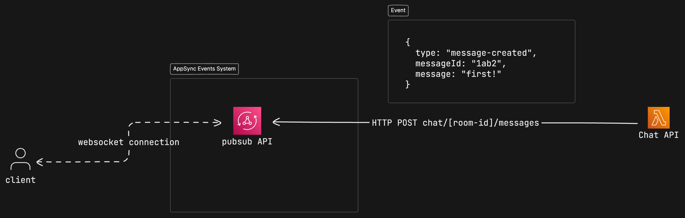

My notes on a project to replace a legacy server-sent-events system with App Sync.

<!-- truncate -->

## The Problem

We have a server-sent-events system, responsible for delivering live chat messages and notifications to clients. It has difficulty scaling in a timely manner requiring manual scaling to stabilize the system when the load increases suddenly. Clients experience slowness and lag, sometime up to 2 minutes of unresponsiveness in the chat.

This system is hosted on dedicated cloud servers, and we're not able to scale the system completely down to zero. We would like a system that can scale up to meet demand very fast, and scale down to zero when there is no demand.

## Non-functional requirements

Support > 30K concurrent connected users

Support > 25K messages per day

Support > 5K unique chatters

## Approach 1: AWS API Gateway Websocket API

Use [AWS API Gateway Websocket API](https://docs.aws.amazon.com/apigateway/latest/developerguide/websocket-api-chat-app.html#websocket-api-chat-app-create-api) to create a new websocket API.

This approach does not make it easy to send messages to 1000s of connected users, there’s a bottleneck at the point where we send messages back through the API.

[Does not scale for broadcasting to large groups of users](https://www.youtube.com/watch?v=CieaIZrpGhs&t=527s&ab_channel=MasterAWSwithYan)

## Approach 2: AppSync Events

[AWS Announcing AWS AppSync Events](https://aws.amazon.com/blogs/mobile/announcing-aws-appsync-events-serverless-websocket-apis/)

AppSync Event API broadcasts real-time updates to subscribed clients over serverless WebSocket, augmented by massively scalable client connection management capabilities.

Provides a useful pubsub system build on a websocket connection.

### Capabilities

- Subscribe via WebSocket, publish via HTTP or WebSocket
- Broadcast 1M messages per second
- Ingest 10K messages per second
- 2K connections per second
- 240 KB per event

### Setup in AWS

- Start by creating an **API**
- Each API has **namespaces** (eg. `messages`)

  - A namespace is a logical grouping of channels
  - [Provides authentication and authorization options](https://docs.aws.amazon.com/appsync/latest/eventapi/configure-event-api-auth.html#aws-lambda-authorization)

- Each namespace has ephemeral **channels**
  - you can publish to channels (eg. `/messages/room-123/messages`)
  - and subscribe to specific or wildcards (eg. `/messages/*`)
- JSON formatted event - 240 KB per event
- Publish is done over HTTP or WebSocket
- Clients can establish multiple subscriptions over a single WebSocket

### Pricing

- $1.00 per million Event API operations. All inbound messages published, outbound messages broadcast, event handlers invoked, and WebSockets operations, like client connection, subscription requests, and ping requests, are considered operations

- $0.08 per million connection minutes.

Broadcast costs can get high:

30K concurrent connected users, 25K messages per day:
750 million operations = ~$750 per day

Since we only need need to support ~5K unique chatters, we can reduce the cost by limiting the number of websocket connections to just the active chatters. Users that are not logged in could use a less realtime setup like polling.

5K active chatters, 25K messages per day:
125 million operations = ~$125 per day
