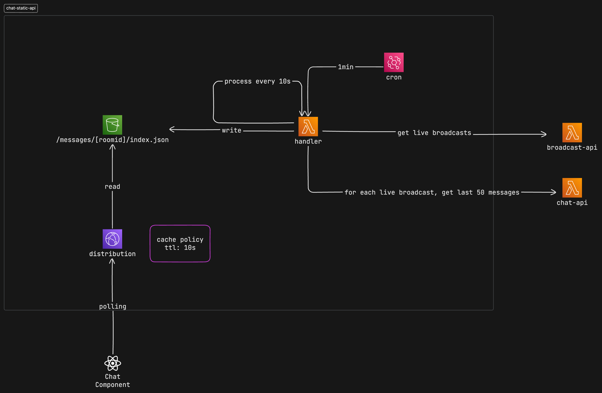

A simple read-only chat system for a live esports event. This is a simple system that reads messages from a chat service and serves them to client via S3 and a Cloudfront distribution.

It's an alternative to our more costly realtime AppSync system, and is intended only for a read-only chat history.

This type of live event chat is not intended for conversation between users, but rather a constant stream of messages and reactions to the live event.

<!-- truncate -->

## First Design Attempt

- A cron jon runs every minute triggering a Lambda process
- The Lambda process reads the latest messages from Chat service
  - it does this every 10s for 1 minute (since 1 minute is the shortest interval for a cron job)
- The Lambda process writes the messages a JSON file in S3
- The Cloudfront distribution serves the JSON file, applying a 10s CloudFront CDN cache
- The client polls the Cloudfront distribution to get the latest messages

Issues with this approach:

- The Lambda process runs constantly, even when there are no messages to process
- Latency is high, if polling is every 5s, maximum latency is 10s cron + 10s cache + 10s polling = 25s
- We may skip messages if there are more than 5 messages per second (50 messages in 10s), which may not be acceptable.



## Second Design Attempt

- A Lambda process is to the data stream of the Chat Service DynamoDB table
- When a message is created/updated/deleted
  - the Lambda process fetches the last 50 messages from the Chat Service DynamoDB table
  - it then writes the messages to a JSON file in S3
- The Cloudfront distribution serves the JSON file, applying a 5s CloudFront CDN cache
- The client polls the Cloudfront distribution to get the latest messages every 5s

The Lambda process only runs when there are changes in the message data stream, so it is not constantly running.

The maximum latency is now 5s cache + 5s polling = 10s

We may skip messages when the volume is 10 messages per second (50 messages in 5s), this may be acceptable. By writing the last 100 messages to the JSON file, we can handle up to 20 messages per second before skipping messages.


## CDK Stacks

### Lambda Stack

```typescript
import * as path from "path";
import * as cdk from "aws-cdk-lib";
import * as lambda from "aws-cdk-lib/aws-lambda";
import * as lambdaNode from "aws-cdk-lib/aws-lambda-nodejs";
import * as eventsources from "aws-cdk-lib/aws-lambda-event-sources";
import * as dynamodb from "aws-cdk-lib/aws-dynamodb";
import * as secretsmanager from "aws-cdk-lib/aws-secretsmanager";
import * as iam from "aws-cdk-lib/aws-iam";
import { enableMonitoring } from "@blastorg/build-cdk-lambda";
import { Construct } from "constructs";
import { config } from "./config";

export class LambdaStack extends cdk.Stack {
  constructor(scope: Construct, id: string, props?: cdk.StackProps) {
    super(scope, id, props);

    const serviceName = `${config.project.context}-${config.project.service}`;

    const crossServerToken = secretsmanager.Secret.fromSecretNameV2(
      this,
      `cross-server-token-lookup`,
      `${config.shortEnvironment}/cross_server_token`
    );

    const functionName = `${serviceName}-dynamo-stream-processor-${config.shortEnvironment}`;
    const lambdaFunction = new lambdaNode.NodejsFunction(
      this,
      "DynamoDBStreamProcessor",
      {
        functionName,
        runtime: lambda.Runtime.NODEJS_22_X,
        entry: path.join(__dirname, "../src/server/handler.ts"),
        handler: "handler",
        memorySize: 512,
        reservedConcurrentExecutions: 1, // Set to 1 to limit concurrency
        timeout: cdk.Duration.minutes(1),
        bundling: {
          sourceMap: true,
          minify: false,
        },
        environment: {
          AWS_ACCOUNT: cdk.Stack.of(this).account,
          STACK_REGION: cdk.Stack.of(this).region,
          ENVIRONMENT: config.environment,
          REPO_NAME: config.repoName,
          BLAST_API_BASE_URL: config.blastApiBaseUrl,
          SERVER_TOKEN: crossServerToken
            .secretValueFromJson("cross_server_token")
            .unsafeUnwrap(),
        },
      }
    );

    // Lookup the DynamoDB table
    const chatMessagesTable = dynamodb.Table.fromTableAttributes(
      this,
      "DynamoTableLookup",
      {
        grantIndexPermissions: true,
        tableName: `chat-messages-${config.shortEnvironment}`,
        tableStreamArn: config.chatMessagesTableArn,
      }
    );

    // Grant Lambda read access to the DynamoDB stream
    chatMessagesTable.grantStreamRead(lambdaFunction);

    // Grant Lambda query access to the DynamoDB table and its GSI
    lambdaFunction.addToRolePolicy(
      new iam.PolicyStatement({
        effect: iam.Effect.ALLOW,
        actions: ["dynamodb:Query"],
        resources: [
          `arn:aws:dynamodb:${cdk.Stack.of(this).region}:${
            cdk.Stack.of(this).account
          }:table/${config.chatMessagesTableName}`,
          `arn:aws:dynamodb:${cdk.Stack.of(this).region}:${
            cdk.Stack.of(this).account
          }:table/${config.chatMessagesTableName}/index/*`,
        ],
      })
    );

    // Add DynamoDB Stream as an event source to Lambda
    lambdaFunction.addEventSource(
      new eventsources.DynamoEventSource(chatMessagesTable, {
        startingPosition: lambda.StartingPosition.LATEST,
        batchSize: 50,
        retryAttempts: 2,
      })
    );

    // s3 permission
    const bucketName = `${serviceName}-${config.shortEnvironment}`;
    lambdaFunction.addToRolePolicy(
      new iam.PolicyStatement({
        effect: iam.Effect.ALLOW,
        actions: ["s3:PutObject", "s3:GetObject", "s3:ListBucket"],
        resources: [
          `arn:aws:s3:::${bucketName}/*`,
          `arn:aws:s3:::${bucketName}`,
        ],
      })
    );

    // monitoring
    enableMonitoring(this, lambdaFunction, {
      environment: config.environment,
      serviceName,
    });
  }
}
```

## Cloudfront Stack

```typescript
import { Construct } from "constructs";
import * as cdk from "aws-cdk-lib";
import * as s3 from "aws-cdk-lib/aws-s3";
import * as cloudfront from "aws-cdk-lib/aws-cloudfront";
import * as cloudfrontOrigins from "aws-cdk-lib/aws-cloudfront-origins";
import * as certificatemanager from "aws-cdk-lib/aws-certificatemanager";

import { config } from "./config";

interface CloudfrontStackProps extends cdk.StackProps {
  originBucket: s3.Bucket;
}

export class CloudfrontStack extends cdk.Stack {
  public readonly distribution: cloudfront.Distribution;

  constructor(scope: Construct, id: string, props: CloudfrontStackProps) {
    super(scope, id, props);

    const serviceName = `${config.project.context}-${config.project.service}`;
    const stackName = `${serviceName}-${config.shortEnvironment}`;

    // S3 bucket
    const s3Origin = new cloudfrontOrigins.S3Origin(props.originBucket, {
      originId: `${stackName}-s3-origin`,
    });

    // certificates
    const certificate = certificatemanager.Certificate
      .fromCertificateArn
      // removed for brevity
      ();

    this.distribution = new cloudfront.Distribution(this, "distribution", {
      comment: stackName,
      certificate,
      // alternate domain names
      domainNames:
        config.shortEnvironment === "prod"
          ? ["chat-readonly.blast.tv"]
          : ["chat-readonly.blast-dev.tv"],

      defaultBehavior: {
        origin: s3Origin,
        allowedMethods: cloudfront.AllowedMethods.ALLOW_ALL,
        responseHeadersPolicy:
          cloudfront.ResponseHeadersPolicy
            .CORS_ALLOW_ALL_ORIGINS_WITH_PREFLIGHT,
      },
    });

    // create a new cache policy
    const cachePolicy = new cloudfront.CachePolicy(this, "cache-policy", {
      cachePolicyName: stackName,
      defaultTtl: cdk.Duration.seconds(5),
    });

    this.distribution.addBehavior("/messages/*", s3Origin, {
      viewerProtocolPolicy: cloudfront.ViewerProtocolPolicy.ALLOW_ALL,
      allowedMethods: cloudfront.AllowedMethods.ALLOW_ALL,
      cachePolicy,
      responseHeadersPolicy:
        cloudfront.ResponseHeadersPolicy.CORS_ALLOW_ALL_ORIGINS_WITH_PREFLIGHT,
    });
  }
}
```

### Bucket Stack

```typescript
import * as cdk from "aws-cdk-lib";
import * as s3 from "aws-cdk-lib/aws-s3";
import { config } from "./config";

export class BucketStack extends cdk.Stack {
  public readonly bucket: s3.Bucket;

  constructor(...[scope, id, props]: ConstructorParameters<typeof cdk.Stack>) {
    super(scope, id, props);
    const serviceName = `${config.project.context}-${config.project.service}`;
    const bucketName = `${serviceName}-${config.shortEnvironment}`;

    this.bucket = new s3.Bucket(this, bucketName, {
      bucketName,
      removalPolicy: cdk.RemovalPolicy.DESTROY,
    });
  }
}
```
