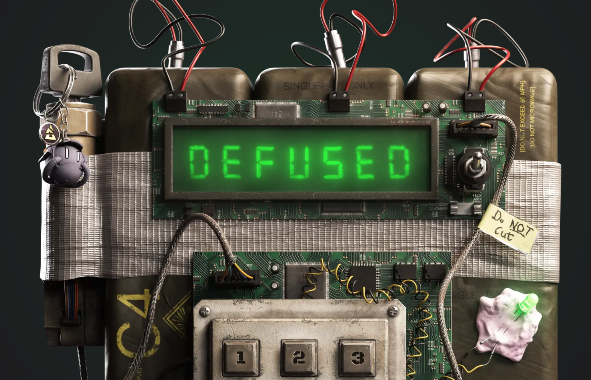
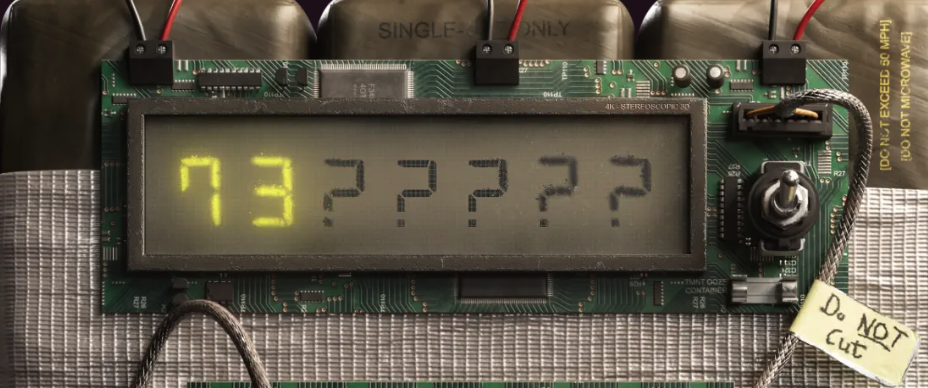

Building a Counter-Strike style quiz game.

<!--  -->

<!-- truncate -->

## The Specification

- Counter-Strike style game with a bomb-defuse mission
- Answer 7 questions in 60s to defuse the bomb
- Each question has 3 incorrect answers and 1 correct answer
- 15s deduction for a wrong answer
- Score is time remaining at the end of the game
- Allow 1 play per player per day
- Persist player's game state

Cheating is inevitable but we expect players to play naturally, there is no real reward to cheating the game. Game logic will be client-side and the server will only store the game state.

## DynamoDB Database

### Questions

Each question is stored in the database as a record.

```
{
    "question": "Who was the MVP of the 2021 PGL Stockholm Major?",
    "answers": ["cadiaN", "s1mple", "sh1ro", "NiKo"],
    "correctAnswer": "s1mple"
}
```

### Daily Quiz (Scheduled Questions)

Every day cron job runs at 8.00 UTC and a new set of questions is selected from the database for the next daily quiz.

```typescript
// get all questions from the questions database
const allQuestions = await questionsDatabase.getQuestions();

// exclude questions from last 3 days
const excludedDates = [
  DateTime.utc().toISODate(), // today
  DateTime.utc().minus({ days: 1 }).toISODate(), // yesterday
  DateTime.utc().minus({ days: 2 }).toISODate(), // 2 days ago
];

const excludedIds = (
  await Promise.all(
    excludedDates.map((date) => schedulesDatabase.getScheduleQuestions(date))
  )
).flatMap((questions) => questions.map((question) => question.id));

const questionsToRandomize = allQuestions.filter(
  (question) => !excludedIds.includes(question.id)
);

// choose random questions:
// game length is 60s, 7 correct questions to win
// penalty for incorrect answer is 5s, so total possible incorrect answers is 60 / 5 = 12 + 6 correct answers = 18
const questions = _.shuffle(questionsToRandomize).slice(0, 18);
const scheduledDate = DateTime.utc().plus({ days: 1 }).toISODate();
```

We use ElectroDB to model the database.

```typescript
import { Entity, EntityItem } from "electrodb";
import { config } from "../../../config";
import { settings } from "./settings";

export const ScheduleEntity = new Entity(
  {
    model: {
      entity: "schedule",
      version: "1",
      service: config.project.service,
    },
    attributes: {
      id: {
        type: "string",
      },
      text: {
        type: "string",
        required: true,
      },
      answers: {
        type: "list",
        required: true,
        items: {
          type: "string",
        },
      },
      correctAnswer: {
        type: "string",
        required: true,
      },
      scheduledDate: {
        type: "string",
        required: true,
      },
      image: {
        type: "string",
      },
    },
    indexes: {
      byDate: {
        pk: {
          field: "pk",
          composite: ["scheduledDate"],
        },
        sk: {
          field: "sk",
          composite: ["id"],
        },
      },
    },
  },
  settings
);

export type DbSchedule = EntityItem<typeof ScheduleEntity>;
```

The index named byDate is defined with two components:

- Partition Key (pk) uses the scheduledDate field, this means all items will be grouped by their scheduled date, in DynamoDB terms this defines how the data is partitioned (how to split when storing on the physical storage).
- Sort Key (sk) uses the id field, allowing us to have multiple items with the same scheduled date, each with a unique ID.

This index structure allows fast querying of all questions for a specific date. For example, you could get all scheduled items for "2024-03-20". Which is the main query we run on this data.

When a questions is scheduled, we create a copy of the original question and store it in the database. This provides a way to track the historical content of the questions. So if a question is updated in the future, it will not affect the questions of previous quizzes.

### Game State

Each user has a game state that tracks their progress in the game.

```typescript
import { Entity, EntityItem } from "electrodb";
import { config } from "../../../config";
import { settings } from "./settings";

export const GameStateEntity = new Entity(
  {
    model: {
      entity: "gameState",
      version: "1",
      service: config.project.service,
    },
    attributes: {
      scheduledDate: {
        type: "string",
        required: true,
      },
      userId: {
        type: "string",
        required: true,
      },
      score: {
        type: "number",
        required: true,
      },
      timeLeft: {
        type: "number",
        required: true,
      },
      questionIndex: {
        type: "number",
        required: true,
      },
    },
    indexes: {
      byUser: {
        pk: {
          field: "pk",
          composite: ["userId"],
        },
        sk: {
          field: "sk",
          composite: ["scheduledDate"],
        },
      },
    },
  },
  settings
);

export type DbGameState = EntityItem<typeof GameStateEntity>;
```

The index named byUser is defined with two components:

- Partition Key (pk) uses the userId field, this means all items will be grouped by the user ID.
- Sort Key (sk) uses the scheduledDate field, allowing us to have multiple items for the same user, each with a unique scheduled date.

This index structure allows fast querying of the game state for a specific user for a specific date.

## API

Simple REST API with GET and POST methods, for example

Get the daily quiz questions for today.

```
GET   {{host}}/v1/cs-quiz/schedules
```

Get/Post the game state for the logged in user

```
GET   {{host}}/v1/cs-quiz/game-state
POST  {{host}}/v1/cs-quiz/game-state
```

## UI

The UI is built with React, the game logic is centralised in a hook. A count-down timer is implemented with useInterval.

```typescript
useInterval(() => {
  if (timeLeft > 0) {
    setTimeLeft((timeLeft) => Math.max(timeLeft - 1, 0));

    // save the game state every 10 seconds
    if (timeLeft % 10 === 0) {
      onAutoSave?.({ score, timeLeft, questionIndex });
    }
  } else {
    endGame("unlucky");
  }
}, timerIncrement);
```

### Countdown Timer

<video controls>
  <source src="/video/timer.mp4" type="video/mp4" />
</video>

The timer digits are custom built SVG components that look like a digital clock display.

```jsx
<Digit digit={minutesTens} />
```

Each segment of the digit is a segment in the SVG that is rendered based on the current digit value. For example, the digit 8 requires all the segments to be shown, whereas the digit 1 requires only two segments to be shown.

```jsx
import classNames from "classnames";

export const Digit = ({
  digit,
  className,
}: {
  digit: number,
  className?: string,
}) => {
  return (
    <svg
      xmlns="http://www.w3.org/2000/svg"
      viewBox="0 0 24 42"
      className={classNames("size-full", className)}
    >
      {/* t */}
      {[0, 2, 3, 5, 6, 7, 8, 9].includes(digit) && (
        <path d="M6.28522 4.96001L3.72522 2.52801L6.28522 0.0960083H18.3172L20.6852 2.52801L18.3172 4.96001H6.28522Z" />
      )}
      {/* tr */}
      {[0, 1, 2, 3, 4, 7, 8, 9].includes(digit) && (
        <path d="M24.0132 5.92001V17.952L21.5812 20.448L19.1492 17.952V5.92001L21.6452 3.23201L24.0132 5.92001Z" />
      )}
      {/* br */}
      {[0, 1, 3, 4, 5, 6, 7, 8, 9].includes(digit) && (
        <path d="M21.6452 21.856L24.0132 24.352V36.448L21.5812 39.136L19.1492 36.448V24.352L21.6452 21.856Z" />
      )}
      {/* b */}
      {[0, 2, 3, 5, 6, 8, 9].includes(digit) && (
        <path d="M18.1892 37.344L20.7492 39.84L18.1892 42.208H6.09322L3.72522 39.776L6.09322 37.344H18.1892Z" />
      )}
      {/* bl */}
      {[0, 2, 6, 8].includes(digit) && (
        <path d="M5.26122 36.448L2.76522 39.136L0.397217 36.448V24.352L2.82922 21.856L5.26122 24.352V36.448Z" />
      )}
      {/* tl */}
      {[0, 4, 5, 6, 8, 9].includes(digit) && (
        <path d="M2.76522 20.448L0.397217 17.952V5.92001L2.82922 3.23201L5.26122 5.92001V17.952L2.76522 20.448Z" />
      )}
      {/* m */}
      {[2, 3, 4, 5, 6, 8, 9].includes(digit) && (
        <path
          d="M18.5442 18.784L21.2322 21.216L18.5442 23.648H6.4482L4.0162 21.216L6.4482 18.784H18.5442Z
          "
        />
      )}
    </svg>
  );
};
```

### The Digital Bomb Countdown

The bomb image is a high-res image of a bomb, we to show a version of it with a digital countdown in several states of the "bomb code" being entered as well as the defused and unlucky states.

We want to avoid down loading separate images for each state, so we use the same image and apply an overlay with transparency to create the effect.


Resulting in a combined image like this for the code being entered:



The "defused" state when the bomb is defused:


And the "unlucky" state when the bomb explodes:


## End Result

The end result is a simple quiz game that is playable in the browser.

